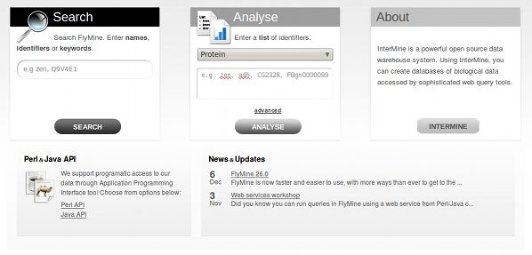
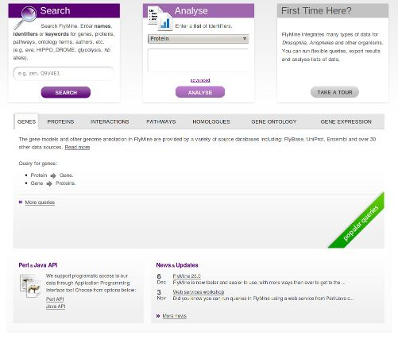

# Home page


This text describes how to customize the homepage of your mine.



See also [General Layout](../layout/index.md) for whole app look & feel


If you have just installed a new mine, your homepage probably looks something like the following:



In order to do any sort of customizations, one has to add/edit a configuration file for the mine. You will find this file in `webapp/src/main/webapp/WEB-INF/web.properties`.

Open this file in your editor of choice and follow the text below.

## Boxes Customization

The three prominent boxes on the homepage will contain a search functionality, a list upload functionality and an info box. You can customise the text these contain and the box title.

### Search box

The first search box is configured thusly:

```text
begin.searchBox.title = Search
begin.searchBox.description = Search FlyMine. Enter <strong>names</strong>, <strong>identifiers</strong> \
or <strong>keywords</strong> for genes, proteins, pathways, ontology terms, authors, etc. (e.g. \
<em>eve</em>, HIPPO_DROME, glycolysis, <em>hb</em> allele).
```


You will find that only the description field accepts HTML.


### Second box

```text
begin.listBox.title = List Upload
begin.listBox.description = Enter a <strong>list</strong> of identifiers.

bag.example.identifiers=CG9151, FBgn0000099, CG3629, TfIIB, Mad, CG1775, CG2262, TWIST_DROME, \
tinman, runt, E2f, CG8817, FBgn0010433, CG9786, CG1034, ftz, FBgn0024250, FBgn0001251, tll, \
CG1374, CG33473, ato, so, CG16738, tramtrack,  CG2328, gt
```

### Third box

The third/info box can contain a descriptive text about your mine or it can offer a link to a tour of the project. Take the example from FlyMine project:

```text
begin.thirdBox.title = First Time Here?
begin.thirdBox.description = FlyMine integrates many types of data for <em>Drosophila</em>, \
<em>Anopheles</em> and other organisms. You can run flexible queries, export results and analyse lists of \
data.
begin.thirdBox.link = http://www.flymine.org/help/tour/start.html
begin.thirdBox.linkTitle = Take a tour
```

By providing the .link parameter a button will be shown at the bottom of the box with a custom link of choice.

You can serve up a custom text in the third "information" box to the user, based on whether they have visited the homepage before or not. We do this through a cookie that will, for a year, indicate for your computer, that the homepage has been visited.

In order to change the values of the third box based on whether the user has visited the page or not, prepend the text "visited" before an uppercased key. For example, if one wanted to say "Welcome Back" instead of "First Time Here?" as the title of the box, we would add the following key=value pair:

```text
begin.thirdBox.visitedTitle = Welcome Back
```

The fields that you do NOT set in this way, will simply show the text configured in the normal way. So even though someone has visited the homepage before, unless I add a "visited" property, the text stays the same as before.

## Popular Templates Customization

To show the ten most popular template queries per category on your homepage like so:



Example:

```text
# web.properties
begin.tabs.1.id = Genomics
```

What this configuration does is it creates a tab on the homepage with \(up to\) 10 most popular templates from a `Genomics` category. For a template to appear in this section, tag it with the Genomics aspect: `im:aspect:Genomics`.


The tag you apply to the template \(e.g. `im:aspect:Genomics`\) must match the value of the `id` attribute \(e.g. `begin.tabs.1.id = Genomics`\).


The number in the config key specifies the order in which we want to show them. So if we have two categories, Genomics and Proteins, and they should appear in this order, we would write this:

```text
begin.tabs.1.id = Genomics
begin.tabs.2.id = Proteins
```

The other customisation we can do is specify an informative text that is to appear in the tab above the templates listing \(again, this text accepts HTML.\):

```text
begin.tabs.1.id = Genomics
begin.tabs.1.description = This is some descriptive text
```

The last thing we will show is how to specify a custom category name to show as a link on the tab \(entirely optional\):

```text
begin.tabs.1.id = Genomics
begin.tabs.1.description = This is some descriptive text
begin.tabs.1.name = Genes
```

Example configuration file: [FlyMine](https://github.com/intermine/flymine/blob/master/webapp/src/main/webapp/WEB-INF/web.properties#L489)

## Featured Lists

Lists with tag `im:homepage` will be shown on the homepage below the templates listing in a natural order, and/or an order specified by `im:order:n`.

To change the description text associated with this set of lists, edit the properties file like so:

```text
begin.listsBox.description = These are the best lists ever
```

## RSS/Blog Feed

To add the RSS feed at the bottom right corner of the page, add the following to your MINE properties file \(in `.intermine` file\):

```text
project.rss = http://<your_blog>/<your_feed_url>
```

eg:

```text
project.rss=http://blog.flymine.org/?feed=rss2
```

Two latest entries will be shown in the box. If you want to provide a link underneath the entry listing to your blog, add the following to the config file:

```text
links.blog = http://<your_blog>
```

